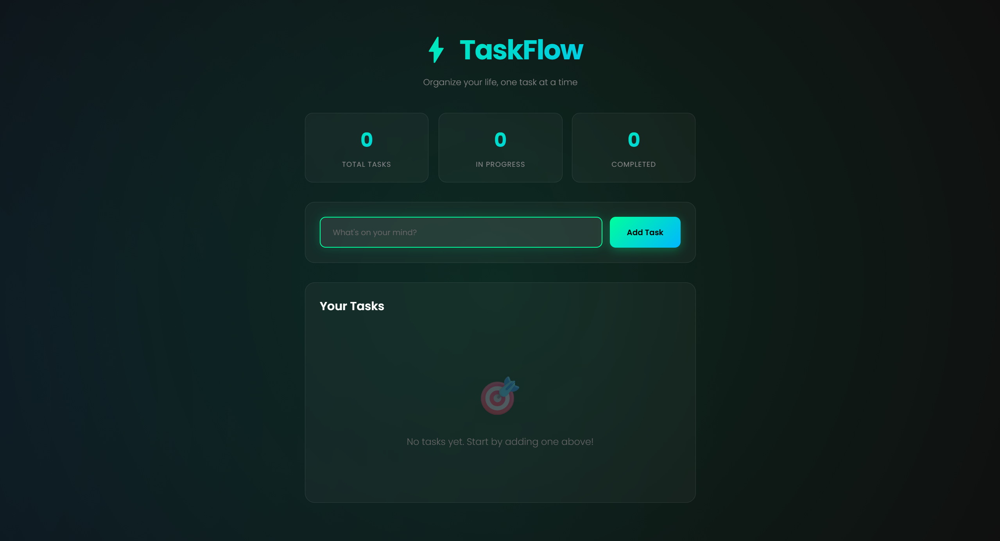
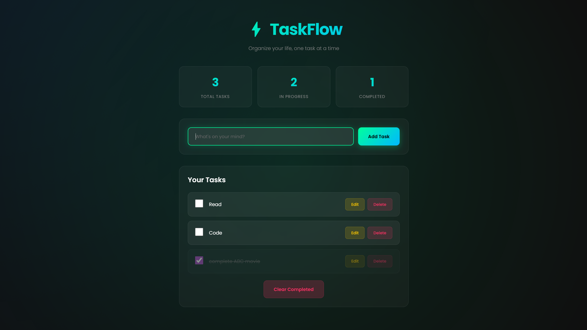
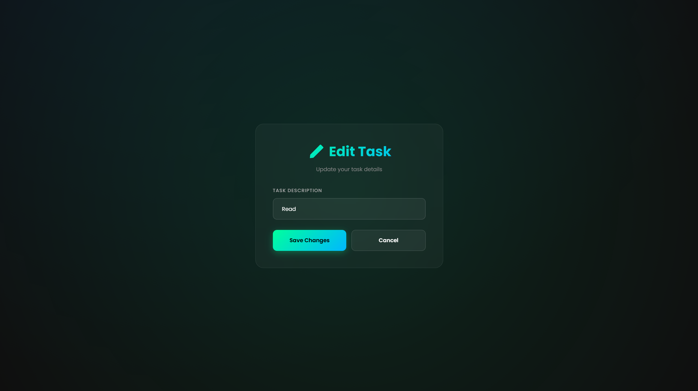

# ⚡ TaskFlow - Modern Todo List Application

A sleek, dark-themed todo list web application built with Flask. TaskFlow helps you organize your tasks with a beautiful cyberpunk-inspired interface featuring glassmorphism design and smooth animations.


## ✨ Features

- **Beautiful Dark UI** - Cyberpunk-inspired design with neon gradients and glassmorphism effects
- **Task Management** - Add, edit, delete, and mark tasks as complete
- **Real-time Statistics** - Track total, in-progress, and completed tasks
- **Smooth Animations** - Fade-in, slide, and hover effects for better UX
- **Responsive Design** - Works seamlessly on desktop, tablet, and mobile devices
- **Clear Completed** - Remove all completed tasks with one click
- **Keyboard Shortcuts** - Quick task entry with Ctrl/Cmd+Enter
- **Confirmation Dialogs** - Prevent accidental deletions

## 🎨 Design Highlights

- **Dark Mode Theme** - Easy on the eyes for extended use
- **Animated Background** - Rotating gradient orbs
- **Custom Checkboxes** - Gradient-filled when checked
- **Glassmorphism Cards** - Frosted glass effect with backdrop blur
- **Neon Accents** - Green-cyan gradient for primary actions
- **Responsive Layout** - Adapts to all screen sizes

## 🚀 Quick Start

### Prerequisites

- Python 3.7 or higher
- pip (Python package installer)

### Installation

1. Clone the repository:
```bash
git clone https://github.com/yourusername/taskflow-todo.git
cd taskflow-todo
```

2. Install Flask:
```bash
pip install flask
```

3. Run the application:
```bash
python app.py
```

4. Open your browser and navigate to:
```
http://127.0.0.1:5000
```

## 📁 Project Structure

```
taskflow-todo/
│
├── app.py                 # Flask application and routes
├── templates/
│   ├── index.html        # Main todo list page
│   └── edit.html         # Edit task page
├── README.md             # Project documentation
└── requirements.txt      # Python dependencies
```

## 🎯 Usage

### Adding a Task
1. Type your task in the input field at the top
2. Click "Add Task" or press Ctrl/Cmd+Enter
3. Your task appears in the list below

### Completing a Task
- Click the checkbox next to any task to mark it as complete
- Completed tasks show with a strikethrough effect

### Editing a Task
1. Click the "Edit" button next to the task
2. Modify the task text
3. Click "Save Changes" or press Enter

### Deleting a Task
- Click the "Delete" button next to any task
- Confirm the deletion in the popup dialog

### Clearing Completed Tasks
- Click "Clear Completed" at the bottom to remove all finished tasks
- Confirm the action in the popup dialog

## 🛠️ Technologies Used

- **Backend:** Flask (Python)
- **Frontend:** HTML5, CSS3, JavaScript
- **Fonts:** Google Fonts (Poppins)
- **Design:** Glassmorphism, CSS Animations, Gradients

## 🎨 Customization

### Changing Colors

Edit the CSS gradient values in `templates/index.html`:

```css
/* Primary gradient (green-cyan) */
background: linear-gradient(135deg, #00ff9d 0%, #00b8ff 100%);

/* Danger color (pink) */
color: #ff3264;

/* Warning color (gold) */
color: #ffc800;
```

### Adjusting Animations

Modify animation duration in the CSS:

```css
animation: fadeInUp 0.6s ease-out;  /* Change 0.6s to your preference */
```

## 📝 API Routes

| Route | Method | Description |
|-------|--------|-------------|
| `/` | GET | Display main todo list |
| `/add` | POST | Add a new task |
| `/edit/<index>` | GET/POST | Edit existing task |
| `/check/<index>` | GET | Toggle task completion |
| `/delete/<index>` | GET | Delete a task |
| `/clear-completed` | POST | Remove all completed tasks |

## 🔮 Future Enhancements

- [ ] Task categories/tags
- [ ] Due dates and reminders
- [ ] Task priority levels
- [ ] Search and filter functionality
- [ ] User authentication
- [ ] Database integration (SQLite/PostgreSQL)
- [ ] Export tasks to CSV/JSON
- [ ] Dark/Light theme toggle
- [ ] Task notes and descriptions
- [ ] Drag-and-drop reordering

## 🤝 Contributing

Contributions are welcome! Please feel free to submit a Pull Request.

1. Fork the project
2. Create your feature branch (`git checkout -b feature/AmazingFeature`)
3. Commit your changes (`git commit -m 'Add some AmazingFeature'`)
4. Push to the branch (`git push origin feature/AmazingFeature`)
5. Open a Pull Request

## 📄 License

This project is licensed under the MIT License - see the [LICENSE](LICENSE) file for details.

## 👤 Author

Your Name
- GitHub: [@yourusername](https://github.com/yourusername)
- Email: your.email@example.com

## 🙏 Acknowledgments

- Inspired by modern todo applications
- Design influenced by cyberpunk aesthetics
- Built with Flask's simplicity and power

## 📸 Screenshots

### Main Interface


### Adding Tasks


### Edit Mode


---

⭐ Star this repo if you find it helpful!

Made with ❤️ and Flask
